#   0.学习目标

- 了解系统架构的演变
- 了解RPC与Http的区别
- 知道什么是SpringCloud
- 独立搭建Eureka注册中心
- 独立配置Robbin负载均衡


# 1.系统架构演变

随着互联网的发展，网站应用的规模不断扩大。需求的激增，带来的是技术上的压力。系统架构也因此不断的演进、升级、迭代。从单一应用，到垂直拆分，到分布式服务，到SOA，以及现在火热的微服务架构，还有在Google带领下来势汹涌的Service Mesh。我们到底是该乘坐微服务的船只驶向远方，还是偏安一隅得过且过？

其实生活不止眼前的苟且，还有诗和远方。所以我们今天就回顾历史，看一看系统架构演变的历程；把握现在，学习现在最火的技术架构；展望未来，争取成为一名优秀的Java工程师。


## 1.1.集中式架构

当网站流量很小时，只需一个应用，将所有功能都部署在一起，以减少部署节点和成本。此时，用于简化增删改查工作量的数据访问框架(ORM)是影响项目开发的关键。

 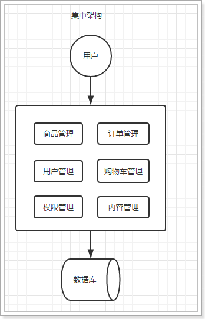

优点：各个功能模块之间调用简单方便

存在的问题：

- 代码耦合，开发维护困难

- 无法针对不同模块进行针对性优化，例如修改某一个方法，该方法可能被其它许多方法调用。修改后其他模面临雪崩状态。

- 无法水平扩展

- 单点容错率低，并发能力差

  


## 1.2.垂直拆分（按功能进行拆分）

当访问量逐渐增大，单一应用无法满足需求，此时为了应对更高的并发和业务需求，我们根据业务功能对系统进行拆分：

 

优点：

- 系统拆分实现了流量分担，解决了并发问题
- 可以针对不同模块进行优化
- 方便水平扩展，负载均衡，容错率提高

缺点：

- 系统间相互独立，会有很多重复开发工作，影响开发效率
- 代码耦合度高，例如用户中心用到了User实体类，订单中心也用到了User实体类。还比如都用到了共同的工具类，代码冗余程度高。


## 1.3.分布式服务

当垂直应用越来越多，应用之间交互不可避免，将核心业务抽取出来，作为独立的服务，逐渐形成稳定的服务中心，使前端应用能更快速的响应多变的市场需求。此时，用于提高业务复用及整合的分布式调用是关键。

 

优点：

- 将基础服务进行了抽取，系统间相互调用，提高了代码复用和开发效率

缺点：

- 系统间耦合度变高，调用关系错综复杂，难以维护


## 1.4.流动计算架构（SOA）

SOA ：面向服务的架构

当服务越来越多，容量的评估，小服务资源的浪费等问题逐渐显现，此时需增加一个调度中心基于访问压力实时管理集群容量，提高集群利用率。此时，用于提高机器利用率的资源调度和治理中心(SOA)是关键


以前出现了什么问题？

- 服务越来越多，需要管理每个服务的地址
- 调用关系错综复杂，难以理清依赖关系
- 服务过多，服务状态难以管理，无法根据服务情况动态管理

服务治理要做什么？

- 服务注册中心，实现服务自动注册和发现，无需人为记录服务地址
- 服务自动订阅，服务列表自动推送，服务调用透明化，无需关心依赖关系
- 动态监控服务状态监控报告，人为控制服务状态

缺点：

- 服务间会有依赖关系，一旦某个环节出错会影响较大
- 服务关系复杂，运维、测试部署困难，不符合DevOps思想

**扩展：**

DevOps是一套使软件开发和IT团队之间的流程自动化的实践，以便他们可以更快，更可靠地构建，测试和发布软件。DevOps的概念建立在建立团队之间协作文化的基础上，这些团队过去一直在相对孤岛中运作。承诺的好处包括增加信任度，更快的软件发布，快速解决关键问题的能力以及更好地管理计划外工作。

在Atlassian，DevOps是仅次于Brangelina（Brad Pitt和Angelina Jolie）的第二个最著名的portmanteau（两个词的结合），汇集了最好的软件开发和IT运营。就像我们的笑话一样，它需要一些解释。 

**本质上，DevOps是一种文化，一种运动，一种哲学**。

这是开发和运营之间的坚定握手，强调思维方式的转变，更好的协作和更紧密的集成。它结合了敏捷，持续交付，自动化等功能，以帮助开发和运营团队提高效率，更快地进行创新并为企业和客户提供更高的价值。

## 1.5.微服务架构

前面说的SOA，英文翻译过来是面向服务。微服务，似乎也是服务，都是对系统进行拆分。因此两者非常容易混淆，但其实却有一些差别：

微服务的特点：

- 单一职责：微服务中每一个服务都对应唯一的业务能力，做到单一职责
- 微：微服务的服务拆分粒度很小，例如一个用户管理就可以作为一个服务。每个服务虽小，但“五脏俱全”。
- 面向服务：面向服务是说每个服务都要对外暴露Rest风格服务接口API。并不关心服务的技术实现，做到与平台和语言无关，也不限定用什么技术实现，只要提供Rest的接口即可。
- 自治：自治是说服务间互相独立，互不干扰
  - 团队独立：每个服务都是一个独立的开发团队，人数不能过多。
  - 技术独立：因为是面向服务，提供Rest接口，使用什么技术没有别人干涉
  - 前后端分离：采用前后端分离开发，提供统一Rest接口，后端不用再为PC、移动段开发不同接口
  - 数据库分离：每个服务都使用自己的数据源
  - 部署独立，服务间虽然有调用，但要做到服务重启不影响其它服务。有利于持续集成和持续交付。每个服务都是独立的组件，可复用，可替换，降低耦合，易维护


微服务结构图：


## 1.6.SOA 和 微服务架构区别

**首先**,肯定的是SOA和微服务的确是一脉相承的，大神Martin Fowler提出来这一概念可以说把SOA的理念继续升华，精进了一步。其核心思想是在应用开发领域，使用一系列微小服务来实现单个应用的方式途径，或者说微服务的目的是有效的拆分应用，实现敏捷开发和部署 ，可以是使用不同的编程语言编写。而SOA可能包含的意义更泛一些，更不准确一些。

**其次**，从实现方式上，两者都是中立性，语言无关，协议跨平台，相比SOA，微服务框架将能够带来更大的敏捷性，并为你构建应用提供更轻量级、更高效率的开发。而SOA更适合大型企业中的业务过程编排、应用集成。另外还有微服务甚至是去ESB、去中心化、分布式的，而SOA还是以ESB为核心，大量的WS标准实现。

**再次**，从服务粒度上，既然是微，必然微服务更倡导服务的细粒度，重用组合，甚至是每个操作（或方法）都是独立开发的服务，足够小到不能再进行拆分。而SOA没有这么极致的要求，只需要接口契约的规范化，内部实现可以更粗粒度，微服务更多为了可扩充性、负载均衡以及提高吞吐量而去分解应用，但同时也引发了打破数据模型以及维护一致性的问题。

**最后**，从部署方式上，这个是最大的不同，对比Monolithic（有人翻译为单体）的Java EE部署架构，通过展现层打包WARs，业务层划分到JARs最后部署为EAR一个大包，而微服务则打开了这个黑盒子，把应用拆分成为一个一个的单个服务，应用Docker技术，不依赖任何服务器和数据模型，是一个 全栈应用，可以通过自动化方式独立部署，每个服务运行在自己的进程中，通过轻量的通讯机制联系，经常是基于HTTP资源API，这些服务基于业务能力构建，能实现集中化管理（因为服务太多啦，不集中管理就无法DevOps啦）。

**ESB：扩展**   

个人理解：SOA和微服务架构都是服务级架构，SOA更加广泛，仍然后中心化的思想，但是微服务架构拆分的粒度更加细，且去中心化。每一个服务都可以独立运行


# 2.服务调用方式

## 2.1.RPC和HTTP  (对内RPC，对外HTTP)

无论是微服务还是SOA，都面临着服务间的远程调用。那么服务间的远程调用方式有哪些呢？

常见的远程调用方式有以下2种：

- RPC：Remote Produce Call远程过程调用，类似的还有RMI。自定义数据格式，基于原生TCP通信，速度快，效率高。早期的webservice，现在热门的dubbo，都是RPC的典型代表

- Http：http其实是一种网络传输协议，基于TCP，规定了数据传输的格式。现在客户端浏览器与服务端通信基本都是采用Http协议，也可以用来进行远程服务调用。缺点是消息封装臃肿，优势是对服务的提供和调用方没有任何技术限定，自由灵活，更符合微服务理念。

  现在热门的Rest风格，就可以通过http协议来实现。


如果你们公司全部采用Java技术栈，那么使用Dubbo作为微服务架构是一个不错的选择。

相反，如果公司的技术栈多样化，而且你更青睐Spring家族，那么SpringCloud搭建微服务是不二之选。在我们的项目中，我们会选择SpringCloud套件，因此我们会使用Http方式来实现服务间调用。


## 2.2.Http客户端工具

既然微服务选择了Http，那么我们就需要考虑自己来实现对请求和响应的处理。不过开源世界已经有很多的http客户端工具，能够帮助我们做这些事情，例如：

- HttpClient
- OKHttp
- URLConnection

接下来，不过这些不同的客户端，API各不相同


## 2.3.Spring的RestTemplate

Spring提供了一个RestTemplate模板工具类，对基于Http的客户端进行了封装，并且实现了对象与json的序列化和反序列化，非常方便。RestTemplate并没有限定Http的客户端类型，而是进行了抽象，目前常用的3种都有支持：

- HttpClient
- OkHttp
- JDK原生的URLConnection（默认的）


我们导入课前资料提供的demo工程：


首先在项目中注册一个`RestTemplate`对象，可以在启动类位置注册：

```java
@SpringBootApplication
public class HttpDemoApplication {

	public static void main(String[] args) {
		SpringApplication.run(HttpDemoApplication.class, args);
	}

	@Bean
	public RestTemplate restTemplate() {
   
		return new RestTemplate();
	}
}
```


在测试类中直接`@Autowired`注入：

```java
@RunWith(SpringRunner.class)
@SpringBootTest(classes = HttpDemoApplication.class)
public class HttpDemoApplicationTests {

	@Autowired
	private RestTemplate restTemplate;

	@Test
	public void httpGet() {
        // 调用springboot案例中的rest接口
		User user = this.restTemplate.getForObject("http://localhost/user/1", User.class);
		System.out.println(user);
	}
}
```

- 通过RestTemplate的getForObject()方法，传递url地址及实体类的字节码，RestTemplate会自动发起请求，接收响应，并且帮我们对响应结果进行反序列化。


学习完了Http客户端工具，接下来就可以正式学习微服务了。


# 3.初识SpringCloud

微服务是一种架构方式，最终肯定需要技术架构去实施。

微服务的实现方式很多，但是最火的莫过于Spring Cloud了。为什么？

- 后台硬：作为Spring家族的一员，有整个Spring全家桶靠山，背景十分强大。
- 技术强：Spring作为Java领域的前辈，可以说是功力深厚。有强力的技术团队支撑，一般人还真比不了
- 群众基础好：可以说大多数程序员的成长都伴随着Spring框架，试问：现在有几家公司开发不用Spring？SpringCloud与Spring的各个框架无缝整合，对大家来说一切都是熟悉的配方，熟悉的味道。
- 使用方便：相信大家都体会到了SpringBoot给我们开发带来的便利，而SpringCloud完全支持SpringBoot的开发，用很少的配置就能完成微服务框架的搭建


## 3.1.简介

SpringCloud是Spring旗下的项目之一，[官网地址：http://projects.spring.io/spring-cloud/](http://projects.spring.io/spring-cloud/)

Spring最擅长的就是集成，把世界上最好的框架拿过来，集成到自己的项目中。

SpringCloud也是一样，它将现在非常流行的一些技术整合到一起，实现了诸如：配置管理，服务发现，智能路由，负载均衡，熔断器，控制总线，集群状态等等功能。其主要涉及的组件包括：

- Eureka：服务治理组件，包含服务注册中心，服务注册与发现机制的实现。（服务治理，服务注册/发现） 
- Zuul：网关组件，提供智能路由，访问过滤功能 
- Ribbon：客户端负载均衡的服务调用组件（客户端负载） 
- Feign：服务调用，给予Ribbon和Hystrix的声明式服务调用组件 （声明式服务调用） 
- Hystrix：容错管理组件，实现断路器模式，帮助服务依赖中出现的延迟和为故障提供强大的容错能力。(熔断、断路器，容错) 

架构图：

 

以上只是其中一部分。


## 3.2.版本

因为Spring Cloud不同其他独立项目，它拥有很多子项目的大项目。所以它的版本是版本名+版本号 （如Angel.SR6）。  

版本名：是伦敦的地铁名  

版本号：SR（Service Releases）是固定的 ,大概意思是稳定版本。后面会有一个递增的数字。 

所以 Edgware.SR3就是Edgware的第3个Release版本。  

 

我们在项目中，会是以Finchley的版本。

其中包含的组件，也都有各自的版本，如下表：

| Component                 | Edgware.SR3    | Finchley.RC1     | Finchley.BUILD-SNAPSHOT |
| ------------------------- | -------------- | ---------------- | ----------------------- |
| spring-cloud-aws          | 1.2.2.RELEASE  | 2.0.0.RC1        | 2.0.0.BUILD-SNAPSHOT    |
| spring-cloud-bus          | 1.3.2.RELEASE  | 2.0.0.RC1        | 2.0.0.BUILD-SNAPSHOT    |
| spring-cloud-cli          | 1.4.1.RELEASE  | 2.0.0.RC1        | 2.0.0.BUILD-SNAPSHOT    |
| spring-cloud-commons      | 1.3.3.RELEASE  | 2.0.0.RC1        | 2.0.0.BUILD-SNAPSHOT    |
| spring-cloud-contract     | 1.2.4.RELEASE  | 2.0.0.RC1        | 2.0.0.BUILD-SNAPSHOT    |
| spring-cloud-config       | 1.4.3.RELEASE  | 2.0.0.RC1        | 2.0.0.BUILD-SNAPSHOT    |
| spring-cloud-netflix      | 1.4.4.RELEASE  | 2.0.0.RC1        | 2.0.0.BUILD-SNAPSHOT    |
| spring-cloud-security     | 1.2.2.RELEASE  | 2.0.0.RC1        | 2.0.0.BUILD-SNAPSHOT    |
| spring-cloud-cloudfoundry | 1.1.1.RELEASE  | 2.0.0.RC1        | 2.0.0.BUILD-SNAPSHOT    |
| spring-cloud-consul       | 1.3.3.RELEASE  | 2.0.0.RC1        | 2.0.0.BUILD-SNAPSHOT    |
| spring-cloud-sleuth       | 1.3.3.RELEASE  | 2.0.0.RC1        | 2.0.0.BUILD-SNAPSHOT    |
| spring-cloud-stream       | Ditmars.SR3    | Elmhurst.RELEASE | Elmhurst.BUILD-SNAPSHOT |
| spring-cloud-zookeeper    | 1.2.1.RELEASE  | 2.0.0.RC1        | 2.0.0.BUILD-SNAPSHOT    |
| spring-boot               | 1.5.10.RELEASE | 2.0.1.RELEASE    | 2.0.0.BUILD-SNAPSHOT    |
| spring-cloud-task         | 1.2.2.RELEASE  | 2.0.0.RC1        | 2.0.0.RELEASE           |
| spring-cloud-vault        | 1.1.0.RELEASE  | 2.0.0.RC1        | 2.0.0.BUILD-SNAPSHOT    |
| spring-cloud-gateway      | 1.0.1.RELEASE  | 2.0.0.RC1        | 2.0.0.BUILD-SNAPSHOT    |
| spring-cloud-openfeign    |                | 2.0.0.RC1        | 2.0.0.BUILD-SNAPSHOT    |

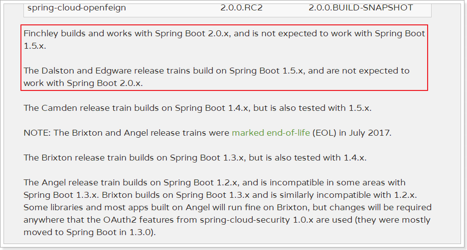

接下来，我们就一一学习SpringCloud中的重要组件。


# 4.微服务场景模拟

首先，我们需要模拟一个服务调用的场景，搭建两个工程：itcast-service-provider（服务提供方）和itcast-service-consumer（服务调用方）。方便后面学习微服务架构

服务提供方：使用mybatis操作数据库，实现对数据的增删改查；并对外提供rest接口服务。

服务消费方：使用restTemplate远程调用服务提供方的rest接口服务，获取数据。

## 4.1.服务提供者

我们新建一个项目：itcast-service-provider，对外提供根据id查询用户的服务。

### 4.1.1.Spring脚手架创建工程

借助于Spring提供的快速搭建工具：


next-->填写项目信息：


next -->  添加web依赖：


添加mybatis依赖：

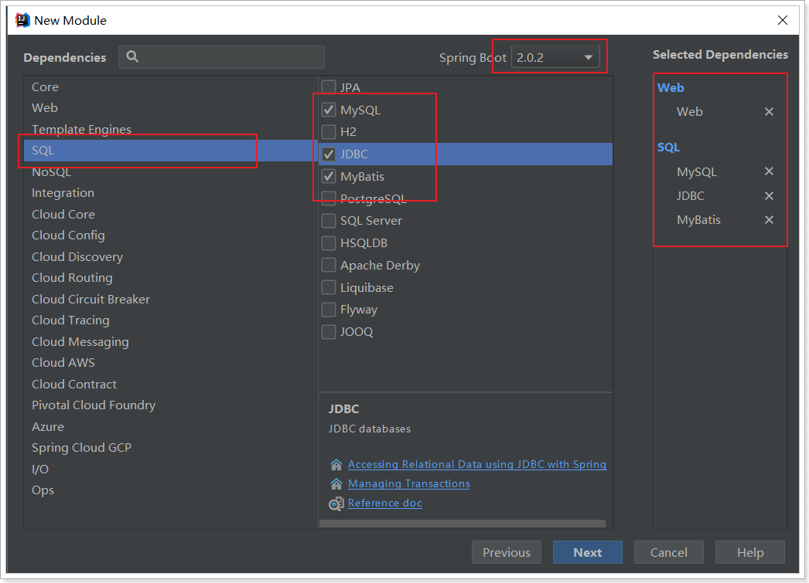

Next -->  填写项目位置：


生成的项目结构，已经包含了引导类（itcastServiceProviderApplication）：

 

依赖也已经全部自动引入：

```xml
<?xml version="1.0" encoding="UTF-8"?>
<project xmlns="http://maven.apache.org/POM/4.0.0" xmlns:xsi="http://www.w3.org/2001/XMLSchema-instance"
         xsi:schemaLocation="http://maven.apache.org/POM/4.0.0 http://maven.apache.org/xsd/maven-4.0.0.xsd">
    <modelVersion>4.0.0</modelVersion>

    <groupId>cn.itcast.service</groupId>
    <artifactId>itcast-service-provider</artifactId>
    <version>0.0.1-SNAPSHOT</version>
    <packaging>jar</packaging>

    <name>itcast-service-provider</name>
    <description>Demo project for Spring Boot</description>

    <parent>
        <groupId>org.springframework.boot</groupId>
        <artifactId>spring-boot-starter-parent</artifactId>
        <version>2.0.6.RELEASE</version>
        <relativePath/> <!-- lookup parent from repository -->
    </parent>

    <properties>
        <project.build.sourceEncoding>UTF-8</project.build.sourceEncoding>
        <project.reporting.outputEncoding>UTF-8</project.reporting.outputEncoding>
        <java.version>1.8</java.version>
    </properties>

    <dependencies>
        <dependency>
            <groupId>org.springframework.boot</groupId>
            <artifactId>spring-boot-starter-jdbc</artifactId>
        </dependency>
        <dependency>
            <groupId>org.springframework.boot</groupId>
            <artifactId>spring-boot-starter-web</artifactId>
        </dependency>
        <dependency>
            <groupId>org.mybatis.spring.boot</groupId>
            <artifactId>mybatis-spring-boot-starter</artifactId>
            <version>1.3.2</version>
        </dependency>

        <dependency>
            <groupId>mysql</groupId>
            <artifactId>mysql-connector-java</artifactId>
            <scope>runtime</scope>
        </dependency>
        <dependency>
            <groupId>org.springframework.boot</groupId>
            <artifactId>spring-boot-starter-test</artifactId>
            <scope>test</scope>
        </dependency>
        <!-- 需要手动引入通用mapper的启动器，spring没有收录该依赖 -->
        <dependency>
            <groupId>tk.mybatis</groupId>
            <artifactId>mapper-spring-boot-starter</artifactId>
            <version>2.0.4</version>
        </dependency>
        
        <dependency>
            <groupId>org.projectlombok</groupId>
            <artifactId>lombok</artifactId>
            <scope>provided</scope>
        </dependency>
    </dependencies>

    <build>
        <plugins>
            <plugin>
                <groupId>org.springframework.boot</groupId>
                <artifactId>spring-boot-maven-plugin</artifactId>
            </plugin>
        </plugins>
    </build>

</project>
```

当然，因为要使用通用mapper，所以我们**需要手动加一条依赖**：

```xml
<dependency>
    <groupId>tk.mybatis</groupId>
    <artifactId>mapper-spring-boot-starter</artifactId>
    <version>2.0.4</version>
</dependency>
```

非常快捷啊！


### 4.1.2.编写代码

 

#### 4.1.2.1.配置

属性文件,这里我们采用了yaml语法，而不是properties：

```yaml
server:
  port: 8081
spring:
  datasource:
    url: jdbc:mysql://localhost:3306/eesy_mybatis 
    username: root
    password: root
mybatis:
  type-aliases-package: cn.itcast.service.pojo
```


#### 4.1.2.2.实体类

```java
@Table(name = "tb_user")
@Data
public class User implements Serializable {

    private static final long serialVersionUID = 1L;

    @Id
    @GeneratedValue(strategy = GenerationType.IDENTITY)
    private Integer id;

    // 姓名
    private String username;
    // 密码
    private String password;
    // 年龄
    private Integer age;
    // 性别
    private String sex;
    // 出生日期
    private Date birthday;
    // 地址
    private String address;
    
    public static long getSerialVersionUID() {
        return serialVersionUID;
    }
   
}
```


#### 4.1.2.3.UserMapper

```java
@Mapper
public interface UserMapper extends tk.mybatis.mapper.common.Mapper<User>{
}
```

#### 4.1.2.4.UserService

```java
@Service
public class UserService {

    @Autowired
    private UserMapper userMapper;

    public User queryById(Integer id) {
        return this.userMapper.selectByPrimaryKey(id);
    }
}
```

#### 4.1.2.5.UserController

添加一个对外查询的接口：

```java
@RestController
@RequestMapping("user")
public class UserController {

    @Autowired
    private UserService userService;

    @GetMapping("{id}")
    public User queryById(@PathVariable("id") Integer id) {
        return this.userService.queryById(id);
    }
}
```

### 4.1.3.启动并测试

启动项目，访问接口：http://localhost:8081/user/1


## 4.2.服务调用者

搭建itcast-service-consumer服务消费方工程。

### 4.2.1.创建工程

与上面类似，这里不再赘述，需要注意的是，我们调用itcast-service-provider的解耦获取数据，因此不需要mybatis相关依赖了。


pom：

```xml
<?xml version="1.0" encoding="UTF-8"?>
<project xmlns="http://maven.apache.org/POM/4.0.0" xmlns:xsi="http://www.w3.org/2001/XMLSchema-instance"
         xsi:schemaLocation="http://maven.apache.org/POM/4.0.0 http://maven.apache.org/xsd/maven-4.0.0.xsd">
    <modelVersion>4.0.0</modelVersion>

    <groupId>cn.itcast.service</groupId>
    <artifactId>itcast-service-consumer</artifactId>
    <version>0.0.1-SNAPSHOT</version>
    <packaging>jar</packaging>

    <name>itcast-service-consumer</name>
    <description>Demo project for Spring Boot</description>

    <parent>
        <groupId>org.springframework.boot</groupId>
        <artifactId>spring-boot-starter-parent</artifactId>
        <version>2.0.4.RELEASE</version>
        <relativePath/> <!-- lookup parent from repository -->
    </parent>

    <properties>
        <project.build.sourceEncoding>UTF-8</project.build.sourceEncoding>
        <project.reporting.outputEncoding>UTF-8</project.reporting.outputEncoding>
        <java.version>1.8</java.version>
    </properties>

    <dependencies>
        <dependency>
            <groupId>org.springframework.boot</groupId>
            <artifactId>spring-boot-starter-web</artifactId>
        </dependency>

        <dependency>
            <groupId>org.springframework.boot</groupId>
            <artifactId>spring-boot-starter-test</artifactId>
            <scope>test</scope>
        </dependency>
        
        <dependency>
            <groupId>org.projectlombok</groupId>
            <artifactId>lombok</artifactId>
            <scope>provided</scope>
        </dependency>
    </dependencies>

    <build>
        <plugins>
            <plugin>
                <groupId>org.springframework.boot</groupId>
                <artifactId>spring-boot-maven-plugin</artifactId>
            </plugin>
        </plugins>
    </build>


</project>

```


### 4.2.2.编写代码

 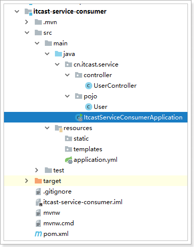

首先在引导类中注册`RestTemplate`：

```java
@SpringBootApplication
public class ItcastServiceConsumerApplication {

    @Bean
    public RestTemplate restTemplate() {
        return new RestTemplate();
    }

    public static void main(String[] args) {
        SpringApplication.run(ItcastServiceConsumerApplication.class, args);
    }
}
```

编写配置（application.yml）：

```
server:
  port: 80
```

编写UserController：

```java
@Controller
@RequestMapping("consumer/user")
public class UserController {

    @Autowired
    private RestTemplate restTemplate;

    @GetMapping
    @ResponseBody
    public User queryUserById(@RequestParam("id") Integer id){
        User user = this.restTemplate.getForObject("http://localhost:8081/user/" + id, User.class);
        return user;
    }

}
```

pojo对象（User）：

```java
@Data
public class User implements Serializable {

    private static final Integer serialVersionUID = 41;

    private Integer id;
    private String username;
    private Date birthday;
    private String sex;
    private String address;
}
```


### 4.2.3.启动测试

因为我们没有配置端口，那么默认就是8080，我们访问：http://localhost/consumer/user?id=1


一个简单的远程服务调用案例就实现了。


## 4.3.有没有问题？

简单回顾一下，刚才我们写了什么：

- itcast-service-provider：一个提供根据id查询用户的微服务。
- itcast-service-consumer：一个服务调用者，通过RestTemplate远程调用itcast-service-provider。

存在什么问题？

- 在consumer中，我们把url地址硬编码到了代码中，不方便后期维护
- consumer需要记忆provider的地址，如果出现变更，可能得不到通知，地址将失效
- consumer不清楚provider的状态，服务宕机也不知道
- provider只有1台服务，不具备高可用性
- 即便provider形成集群，consumer还需自己实现负载均衡

其实上面说的问题，概括一下就是分布式服务必然要面临的问题：

- 服务管理
  - 如何自动注册和发现
  - 如何实现状态监管
  - 如何实现动态路由
- 服务如何实现负载均衡
- 服务如何解决容灾问题
- 服务如何实现统一配置

以上的问题，我们都将在SpringCloud中得到答案。


# 5.Eureka注册中心

## 5.1.认识Eureka

首先我们来解决第一问题，服务的管理。

> 问题分析

在刚才的案例中，itcast-service-provider对外提供服务，需要对外暴露自己的地址。而consumer（调用者）需要记录服务提供者的地址。将来地址出现变更，还需要及时更新。这在服务较少的时候并不觉得有什么，但是在现在日益复杂的互联网环境，一个项目肯定会拆分出十几，甚至数十个微服务。此时如果还人为管理地址，不仅开发困难，将来测试、发布上线都会非常麻烦，这与DevOps的思想是背道而驰的。

> 网约车

这就好比是 网约车出现以前，人们出门叫车只能叫出租车。一些私家车想做出租却没有资格，被称为黑车。而很多人想要约车，但是无奈出租车太少，不方便。私家车很多却不敢拦，而且满大街的车，谁知道哪个才是愿意载人的。一个想要，一个愿意给，就是缺少引子，缺乏管理啊。

此时滴滴这样的网约车平台出现了，所有想载客的私家车全部到滴滴注册，记录你的车型（服务类型），身份信息（联系方式）。这样提供服务的私家车，在滴滴那里都能找到，一目了然。

此时要叫车的人，只需要打开APP，输入你的目的地，选择车型（服务类型），滴滴自动安排一个符合需求的车到你面前，为你服务，完美！

> Eureka做什么？

Eureka就好比是滴滴，负责管理、记录服务提供者的信息。服务调用者无需自己寻找服务，而是把自己的需求告诉Eureka，然后Eureka会把符合你需求的服务告诉你。

同时，服务提供方与Eureka之间通过`“心跳”`机制进行监控，当某个服务提供方出现问题，Eureka自然会把它从服务列表中剔除。

这就实现了服务的自动注册、发现、状态监控。


## 5.2.原理图

> 基本架构：

 


- Eureka：就是服务注册中心（可以是一个集群），对外暴露自己的地址
- 提供者：启动后向Eureka注册自己信息（地址，提供什么服务）
- 消费者：向Eureka订阅服务，Eureka会将对应服务的所有提供者地址列表发送给消费者，并且定期更新
- 心跳(续约)：提供者定期通过http方式向Eureka刷新自己的状态


## 5.3.入门案例

### 5.3.1.搭建EurekaServer

接下来我们创建一个项目，启动一个EurekaServer：

依然使用spring提供的快速搭建工具：

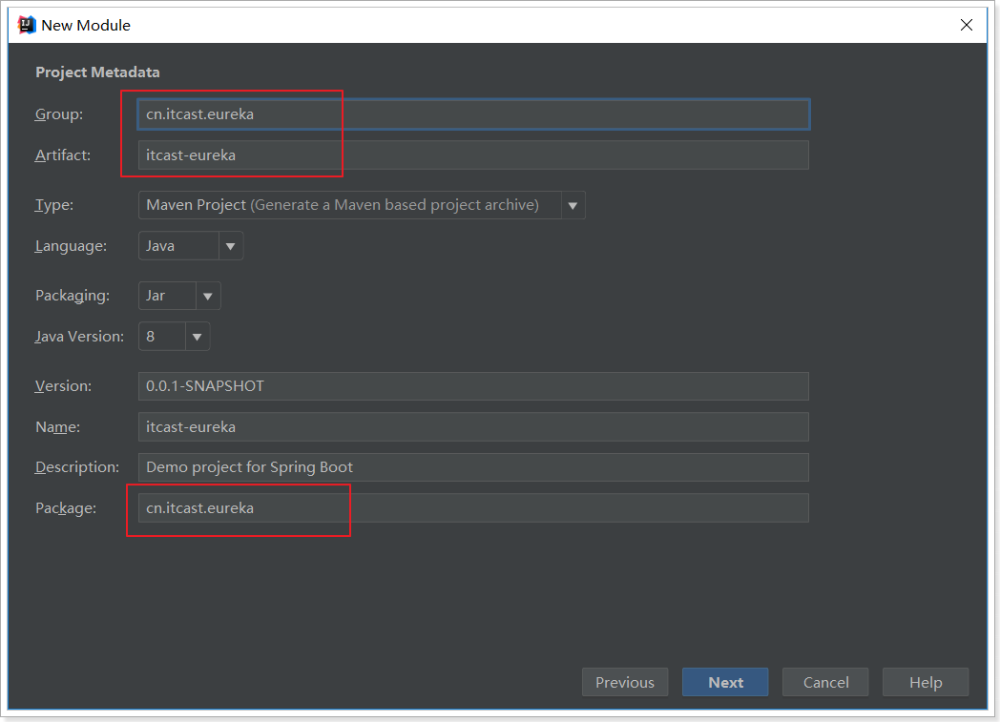

选择依赖：EurekaServer-服务注册中心依赖，Eureka Discovery-服务提供方和服务消费方。因为，对于eureka来说：服务提供方和服务消费方都属于客户端


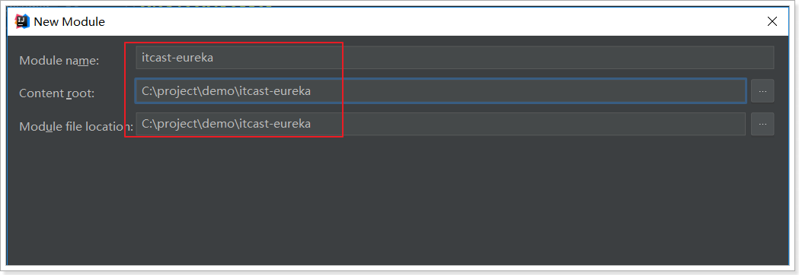

完整的Pom文件：

```xml
<?xml version="1.0" encoding="UTF-8"?>
<project xmlns="http://maven.apache.org/POM/4.0.0" xmlns:xsi="http://www.w3.org/2001/XMLSchema-instance"
         xsi:schemaLocation="http://maven.apache.org/POM/4.0.0 http://maven.apache.org/xsd/maven-4.0.0.xsd">
    <modelVersion>4.0.0</modelVersion>

    <groupId>cn.itcast.eureka</groupId>
    <artifactId>itcast-eureka</artifactId>
    <version>0.0.1-SNAPSHOT</version>
    <packaging>jar</packaging>

    <name>itcast-eureka</name>
    <description>Demo project for Spring Boot</description>

    <parent>
        <groupId>org.springframework.boot</groupId>
        <artifactId>spring-boot-starter-parent</artifactId>
        <version>2.0.6.RELEASE</version>
        <relativePath/> <!-- lookup parent from repository -->
    </parent>

    <properties>
        <project.build.sourceEncoding>UTF-8</project.build.sourceEncoding>
        <project.reporting.outputEncoding>UTF-8</project.reporting.outputEncoding>
        <java.version>1.8</java.version>
        <spring-cloud.version>Finchley.RC2</spring-cloud.version>
    </properties>

    <dependencies>
        <dependency>
            <groupId>org.springframework.cloud</groupId>
            <artifactId>spring-cloud-starter-netflix-eureka-server</artifactId>
        </dependency>

    </dependencies>

    <build>
        <plugins>
            <plugin>
                <groupId>org.springframework.boot</groupId>
                <artifactId>spring-boot-maven-plugin</artifactId>
            </plugin>
        </plugins>
    </build>

</project>
```

编写application.yml配置：

```yaml
server:
  port: 10086 # 端口
spring:
  application:
    name: eureka-server # 应用名称，会在Eureka中显示
eureka:
  client:
    service-url: # EurekaServer的地址，现在是自己的地址，如果是集群，需要加上其它Server的地址。
      defaultZone: http://127.0.0.1:${server.port}/eureka
```

修改引导类，在类上添加@EnableEurekaServer注解：

```java
@SpringBootApplication
@EnableEurekaServer // 声明当前springboot应用是一个eureka服务中心
public class ItcastEurekaApplication {

    public static void main(String[] args) {
        SpringApplication.run(ItcastEurekaApplication.class, args);
    }
}
```

启动服务，并访问：http://127.0.0.1:10086


### 5.3.2.注册到Eureka

注册服务，就是在服务上添加Eureka的客户端依赖，客户端代码会自动把服务注册到EurekaServer中。

修改itcast-service-provider工程

1. 在pom.xml中，添加springcloud的相关依赖。
2. 在application.yml中，添加springcloud的相关依赖。
3. 在引导类上添加注解，把服务注入到eureka注册中心。

具体操作

#### 5.3.2.1.pom.xml

参照itcast-eureka，先添加SpringCloud依赖：

```xml
<!-- SpringCloud的依赖 -->
<dependencyManagement>
    <dependencies>
        <dependency>
            <groupId>org.springframework.cloud</groupId>
            <artifactId>spring-cloud-dependencies</artifactId>
            <version>Finchley.SR2</version>
            <type>pom</type>
            <scope>import</scope>
        </dependency>
    </dependencies>
</dependencyManagement>
```

然后是Eureka客户端：

```xml
<!-- Eureka客户端 -->
<dependency>
    <groupId>org.springframework.cloud</groupId>
    <artifactId>spring-cloud-starter-netflix-eureka-client</artifactId>
</dependency>
```

完整pom.xml:

```xml
<?xml version="1.0" encoding="UTF-8"?>
<project xmlns="http://maven.apache.org/POM/4.0.0" xmlns:xsi="http://www.w3.org/2001/XMLSchema-instance"
         xsi:schemaLocation="http://maven.apache.org/POM/4.0.0 http://maven.apache.org/xsd/maven-4.0.0.xsd">
    <modelVersion>4.0.0</modelVersion>

    <groupId>cn.itcast.service</groupId>
    <artifactId>itcast-service-provider</artifactId>
    <version>0.0.1-SNAPSHOT</version>
    <packaging>jar</packaging>

    <name>itcast-service-provider</name>
    <description>Demo project for Spring Boot</description>

    <parent>
        <groupId>org.springframework.boot</groupId>
        <artifactId>spring-boot-starter-parent</artifactId>
        <version>2.0.6.RELEASE</version>
        <relativePath/> <!-- lookup parent from repository -->
    </parent>

    <properties>
        <project.build.sourceEncoding>UTF-8</project.build.sourceEncoding>
        <project.reporting.outputEncoding>UTF-8</project.reporting.outputEncoding>
        <java.version>1.8</java.version>
    </properties>

    <dependencies>
        <dependency>
            <groupId>org.springframework.boot</groupId>
            <artifactId>spring-boot-starter-jdbc</artifactId>
        </dependency>
        <dependency>
            <groupId>org.springframework.boot</groupId>
            <artifactId>spring-boot-starter-web</artifactId>
        </dependency>
        <dependency>
            <groupId>org.mybatis.spring.boot</groupId>
            <artifactId>mybatis-spring-boot-starter</artifactId>
            <version>1.3.2</version>
        </dependency>

        <dependency>
            <groupId>mysql</groupId>
            <artifactId>mysql-connector-java</artifactId>
            <scope>runtime</scope>
        </dependency>
        <dependency>
            <groupId>org.springframework.boot</groupId>
            <artifactId>spring-boot-starter-test</artifactId>
            <scope>test</scope>
        </dependency>
        <dependency>
            <groupId>tk.mybatis</groupId>
            <artifactId>mapper-spring-boot-starter</artifactId>
            <version>2.0.4</version>
        </dependency>
        <dependency>
            <groupId>org.springframework.cloud</groupId>
            <artifactId>spring-cloud-starter-netflix-eureka-client</artifactId>
        </dependency>
    </dependencies>

    <build>
        <plugins>
            <plugin>
                <groupId>org.springframework.boot</groupId>
                <artifactId>spring-boot-maven-plugin</artifactId>
            </plugin>
        </plugins>
    </build>

    <dependencyManagement>
        <dependencies>
            <dependency>
                <groupId>org.springframework.cloud</groupId>
                <artifactId>spring-cloud-dependencies</artifactId>
                <version>Finchley.SR1</version>
                <type>pom</type>
                <scope>import</scope>
            </dependency>
        </dependencies>
    </dependencyManagement>

</project>
```

#### 5.3.2.2.application.yml

```yaml
server:
  port: 8081
spring:
  datasource:
    url: jdbc:mysql://localhost:3306/heima
    username: root
    password: root
    driverClassName: com.mysql.jdbc.Driver
  application:
    name: service-provider # 应用名称，注册到eureka后的服务名称
mybatis:
  type-aliases-package: cn.itcast.service.pojo
eureka:
  client:
    service-url: # EurekaServer地址
      defaultZone: http://127.0.0.1:10086/eureka
```

注意：

- 这里我们添加了spring.application.name属性来指定应用名称，将来会作为应用的id使用。


#### 5.3.2.3.引导类

在引导类上开启Eureka客户端功能

通过添加`@EnableDiscoveryClient`来开启Eureka客户端功能

```java
@SpringBootApplication
@EnableDiscoveryClient
public class ItcastServiceProviderApplication {

    public static void main(String[] args) {
        SpringApplication.run(ItcastServiceApplication.class, args);
    }
}
```


> 重启项目，访问[Eureka监控页面](http://127.0.0.1:10086)查看


我们发现service-provider服务已经注册成功了


### 5.3.3.从Eureka获取服务

接下来我们修改itcast-service-consumer，尝试从EurekaServer获取服务。

方法与消费者类似，只需要在项目中添加EurekaClient依赖，就可以通过服务名称来获取信息了！

1. pom.xml

```xml
<?xml version="1.0" encoding="UTF-8"?>
<project xmlns="http://maven.apache.org/POM/4.0.0" xmlns:xsi="http://www.w3.org/2001/XMLSchema-instance"
         xsi:schemaLocation="http://maven.apache.org/POM/4.0.0 http://maven.apache.org/xsd/maven-4.0.0.xsd">
    <modelVersion>4.0.0</modelVersion>

    <groupId>cn.itcast.service</groupId>
    <artifactId>itcast-service-consumer</artifactId>
    <version>0.0.1-SNAPSHOT</version>
    <packaging>jar</packaging>

    <name>itcast-service-consumer</name>
    <description>Demo project for Spring Boot</description>

    <parent>
        <groupId>org.springframework.boot</groupId>
        <artifactId>spring-boot-starter-parent</artifactId>
        <version>2.0.6.RELEASE</version>
        <relativePath/> <!-- lookup parent from repository -->
    </parent>

    <properties>
        <project.build.sourceEncoding>UTF-8</project.build.sourceEncoding>
        <project.reporting.outputEncoding>UTF-8</project.reporting.outputEncoding>
        <java.version>1.8</java.version>
    </properties>

    <dependencies>
        <dependency>
            <groupId>org.springframework.boot</groupId>
            <artifactId>spring-boot-starter-web</artifactId>
        </dependency>

        <dependency>
            <groupId>org.springframework.boot</groupId>
            <artifactId>spring-boot-starter-test</artifactId>
            <scope>test</scope>
        </dependency>
        <!-- Eureka客户端 -->
        <dependency>
            <groupId>org.springframework.cloud</groupId>
            <artifactId>spring-cloud-starter-netflix-eureka-client</artifactId>
        </dependency>
    </dependencies>

    <build>
        <plugins>
            <plugin>
                <groupId>org.springframework.boot</groupId>
                <artifactId>spring-boot-maven-plugin</artifactId>
            </plugin>
        </plugins>
    </build>

    <!-- SpringCloud的依赖 -->
    <dependencyManagement>
        <dependencies>
            <dependency>
                <groupId>org.springframework.cloud</groupId>
                <artifactId>spring-cloud-dependencies</artifactId>
                <version>Finchley.SR2</version>
                <type>pom</type>
                <scope>import</scope>
            </dependency>
        </dependencies>
    </dependencyManagement>
</project>

```

2. 修改配置

```yaml
server:
  port: 80
spring:
  application:
    name: service-consumer
eureka:
  client:
    service-url:
      defaultZone: http://localhost:10086/eureka
```


3. 在启动类开启Eureka客户端

```java
@SpringBootApplication
@EnableDiscoveryClient // 开启Eureka客户端
public class ItcastServiceConsumerApplication {

    @Bean
    public RestTemplate restTemplate(){
        return new RestTemplate();
    }

    public static void main(String[] args) {
        SpringApplication.run(ItcastServiceConsumerApplication.class, args);
    }
}
```

4. 修改UserController代码，用DiscoveryClient类的方法，根据服务名称，获取服务实例：

```java
@Controller
@RequestMapping("consumer/user")
public class UserController {

    @Autowired
    private RestTemplate restTemplate;

    @Autowired
    private DiscoveryClient discoveryClient; // eureka客户端，可以获取到eureka中服务的信息

    @GetMapping
    @ResponseBody
    public User queryUserById(@RequestParam("id") Integer id){
        // 根据服务名称，获取服务实例。有可能是集群，所以是service实例集合
        List<ServiceInstance> instances = discoveryClient.getInstances("service-provider");
        // 因为只有一个Service-provider。所以获取第一个实例
        ServiceInstance instance = instances.get(0);
        // 获取ip和端口信息，拼接成服务地址
        String baseUrl = "http://" + instance.getHost() + ":" + instance.getPort() + "/user/" + id;
        User user = this.restTemplate.getForObject(baseUrl, User.class);
        return user;
    }

}
```


5）Debug跟踪运行：


生成的URL：

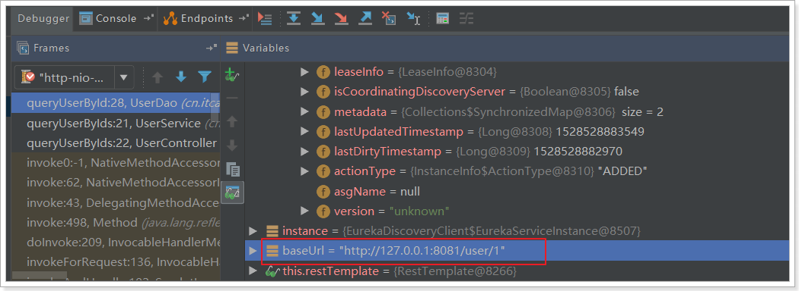

访问结果：


## 5.4.Eureka详解

接下来我们详细讲解Eureka的原理及配置。

### 5.4.1.基础架构

Eureka架构中的三个核心角色：

- 服务注册中心

  Eureka的服务端应用，提供服务注册和发现功能，就是刚刚我们建立的itcast-eureka。

- 服务提供者

  提供服务的应用，可以是SpringBoot应用，也可以是其它任意技术实现，只要对外提供的是Rest风格服务即可。本例中就是我们实现的itcast-service-provider。

- 服务消费者

  消费应用从注册中心获取服务列表，从而得知每个服务方的信息，知道去哪里调用服务方。本例中就是我们实现的itcast-service-consumer。


### 5.4.2.高可用的Eureka Server

Eureka Server即服务的注册中心，在刚才的案例中，我们只有一个EurekaServer，事实上EurekaServer也可以是一个集群，形成高可用的Eureka中心。

> 服务同步

多个Eureka Server之间也会互相注册为服务，当服务提供者注册到Eureka Server集群中的某个节点时，该节点会把服务的信息同步给集群中的每个节点，从而实现**数据同步**。因此，无论客户端访问到Eureka Server集群中的任意一个节点，都可以获取到完整的服务列表信息。


> 动手搭建高可用的EurekaServer

我们假设要运行两个EurekaServer的集群，端口分别为：10086和10087。只需要把itcast-eureka启动两次即可。

1）启动第一个eurekaServer，我们修改原来的EurekaServer配置：

```yaml
server:
  port: 10086 # 端口  
spring:
  application:
    name: eureka-server # 应用名称，会在Eureka中显示
eureka:
  client:
    service-url: # 配置其他Eureka服务的地址，而不是自己，比如10087
      defaultZone: http://127.0.0.1:10087/eureka
```

所谓的高可用注册中心，其实就是把EurekaServer自己也作为一个服务进行注册，这样多个EurekaServer之间就能互相发现对方，从而形成集群。因此我们做了以下修改：

- 把service-url的值改成了另外一台EurekaServer的地址，而不是自己

启动报错，很正常。因为10087服务没有启动：


2）启动第二个eurekaServer，再次修改itcast-eureka的配置：

```yaml
server:
  port: 10087 # 端口
spring:
  application:
    name: eureka-server # 应用名称，会在Eureka中显示
eureka:
  client:
    service-url: # 配置其他Eureka服务的地址，而不是自己，比如10087
      defaultZone: http://127.0.0.1:10086/eureka
```

注意：idea中一个应用不能启动两次，我们需要重新配置一个启动器：


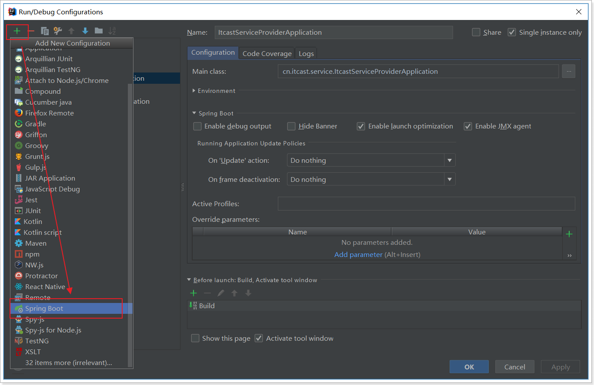

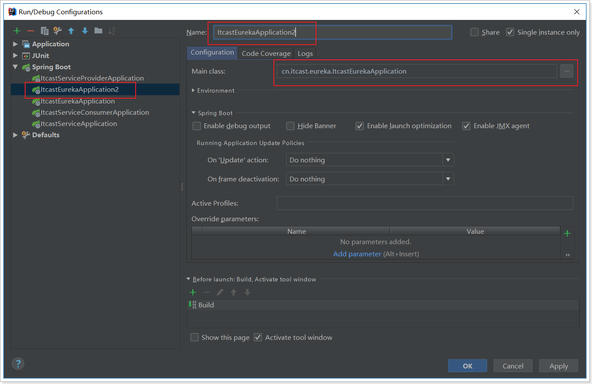

然后启动即可。

3）访问集群，测试：


4）客户端注册服务到集群

因为EurekaServer不止一个，因此注册服务的时候，service-url参数需要变化：

```yaml
eureka:
  client:
    service-url: # EurekaServer地址,多个地址以','隔开
      defaultZone: http://127.0.0.1:10086/eureka,http://127.0.0.1:10087/eureka
```


10086：


10087：


### 5.4.3.服务提供者

服务提供者要向EurekaServer注册服务，并且完成服务续约等工作。

> 服务注册

服务提供者在启动时，会检测配置属性中的：`eureka.client.register-with-eureka=true`参数是否正确，事实上默认就是true。如果值确实为true，则会向EurekaServer发起一个Rest请求，并携带自己的元数据信息，Eureka Server会把这些信息保存到一个双层Map结构中。

- 第一层Map的Key就是服务id，一般是配置中的`spring.application.name`属性
- 第二层Map的key是服务的实例id。一般host+ serviceId + port，例如：`locahost:service-provider:8081`
- 值则是服务的实例对象，也就是说一个服务，可以同时启动多个不同实例，形成集群。

> 服务续约

在注册服务完成以后，服务提供者会维持一个心跳（定时向EurekaServer发起Rest请求），告诉EurekaServer：“我还活着”。这个我们称为**服务的续约（renew）**；

有两个重要参数可以修改服务续约的行为：

```yaml
eureka:
  instance:
    lease-expiration-duration-in-seconds: 90
    lease-renewal-interval-in-seconds: 30
```

- lease-renewal-interval-in-seconds：服务续约(renew)的间隔，默认为30秒
- lease-expiration-duration-in-seconds：服务失效时间，默认值90秒

也就是说，默认情况下每个30秒服务会向注册中心发送一次心跳，证明自己还活着。如果超过90秒没有发送心跳，EurekaServer就会认为该服务宕机，会从服务列表中移除，这两个值在生产环境不要修改，默认即可。

但是在开发时，这个值有点太长了，经常我们关掉一个服务，会发现Eureka依然认为服务在活着。所以我们在开发阶段可以适当调小。

```yaml
eureka:
  instance:
    lease-renewal-interval-in-seconds: 5 # 5秒一次心跳
    lease-expiration-duration-in-seconds: 10 # 10秒即过期
```

**英语学习：**

​    lease：租约，租赁

   renewal： 更新，恢复，补充，合同续订

   interval：间隔，间距

   expiration：呼气，终结

  duration：持续

### 5.4.4.服务消费者

> 获取服务列表 

当服务消费者启动时，会检测`eureka.client.fetch-registry=true`参数的值，如果为true，则会拉取Eureka Server服务的列表只读备份，然后缓存在本地。并且`每隔30秒`会重新获取并更新数据。我们可以通过下面的参数来修改：

```yaml
eureka:
  client:
    registry-fetch-interval-seconds: 5
```

生产环境中，我们不需要修改这个值。

但是为了开发环境下，能够快速得到服务的最新状态，我们可以将其设置小一点。


### 5.4.5.失效剔除和自我保护

> 服务下线  

当服务进行正常关闭操作时，它会触发一个服务下线的REST请求给Eureka Server，告诉服务注册中心：“我要下线了”。服务中心接受到请求之后，将该服务置为下线状态。

> 失效剔除

有些时候，我们的服务提供方并不一定会正常下线，可能因为内存溢出、网络故障等原因导致服务无法正常工作。Eureka Server需要将这样的服务剔除出服务列表。因此它会开启一个定时任务，每隔60秒对所有失效的服务（超过90秒未响应）进行剔除。

可以通过`eureka.server.eviction-interval-timer-in-ms`参数对其进行修改，单位是毫秒，生产环境不要修改。

这个会对我们开发带来极大的不变，你对服务重启，隔了60秒Eureka才反应过来。开发阶段可以适当调整，比如：10秒

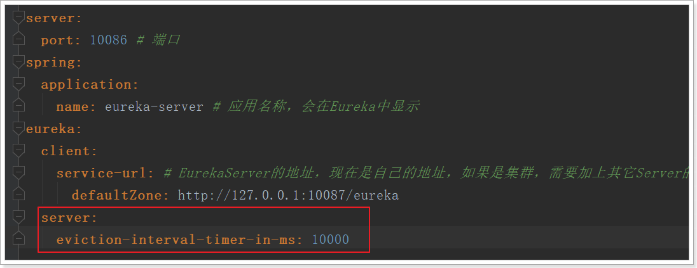


> 自我保护

我们关停一个服务，就会在Eureka面板看到一条警告：


这是触发了Eureka的自我保护机制。当一个服务未按时进行心跳续约时，Eureka会统计最近15分钟心跳失败的服务实例的比例是否超过了85%。在生产环境下，因为网络延迟等原因，心跳失败实例的比例很有可能超标，但是此时就把服务剔除列表并不妥当，因为服务可能没有宕机。Eureka就会把当前实例的注册信息保护起来，不予剔除。生产环境下这很有效，保证了大多数服务依然可用。

但是这给我们的开发带来了麻烦， 因此开发阶段我们都会关闭自我保护模式：（itcast-eureka）

```yaml
eureka:
  server:
    enable-self-preservation: false # 关闭自我保护模式（缺省为打开）
    eviction-interval-timer-in-ms: 1000 # 扫描失效服务的间隔时间（缺省为60*1000ms）
```

preservation：保存，保留

eviction：逐出，赶出


# 6.负载均衡Ribbon

在刚才的案例中，我们启动了一个itcast-service-provider，然后通过DiscoveryClient来获取服务实例信息，然后获取ip和端口来访问。

但是实际环境中，我们往往会开启很多个itcast-service-provider的集群。此时我们获取的服务列表中就会有多个，到底该访问哪一个呢？

一般这种情况下我们就需要编写负载均衡算法，在多个实例列表中进行选择。

不过Eureka中已经帮我们集成了负载均衡组件：Ribbon，简单修改代码即可使用。

什么是Ribbon：


Ribbon：缎带，勋章，带状物

接下来，我们就来使用Ribbon实现负载均衡。


## 6.1.启动两个服务实例

首先参照itcast-eureka启动两个ItcastServiceProviderApplication实例，一个8081，一个8082。

 

Eureka监控面板：


## 6.2.开启负载均衡

因为Eureka中已经集成了Ribbon，所以我们无需引入新的依赖，直接修改代码。

修改itcast-service-consumer的引导类，在RestTemplate的配置方法上添加`@LoadBalanced`注解：

```java
@Bean
@LoadBalanced
public RestTemplate restTemplate() {
    return new RestTemplate();
}
```


修改调用方式，不再手动获取ip和端口，而是直接通过服务名称调用：

```java
@Controller
@RequestMapping("consumer/user")
public class UserController {

    @Autowired
    private RestTemplate restTemplate;

    //@Autowired
    //private DiscoveryClient discoveryClient; // 注入discoveryClient，通过该客户端获取服务列表

    @GetMapping
    @ResponseBody
    public User queryUserById(@RequestParam("id") Long id){
        // 通过client获取服务提供方的服务列表，这里我们只有一个
        // ServiceInstance instance = discoveryClient.getInstances("service-provider").get(0);
        String baseUrl = "http://service-provider/user/" + id;
        User user = this.restTemplate.getForObject(baseUrl, User.class);
        return user;
    }

}
```

访问页面，查看结果：


完美！


## 6.3.源码跟踪

为什么我们只输入了service名称就可以访问了呢？之前还要获取ip和端口。

显然有人帮我们根据service名称，获取到了服务实例的ip和端口。它就是`LoadBalancerInterceptor`

在如下代码打断点：


一路源码跟踪：RestTemplate.getForObject --> RestTemplate.execute --> RestTemplate.doExecute：


点击进入AbstractClientHttpRequest.execute --> AbstractBufferingClientHttpRequest.executeInternal --> InterceptingClientHttpRequest.executeInternal --> InterceptingClientHttpRequest.execute:


继续跟入：LoadBalancerInterceptor.intercept方法


继续跟入execute方法：发现获取了8082端口的服务

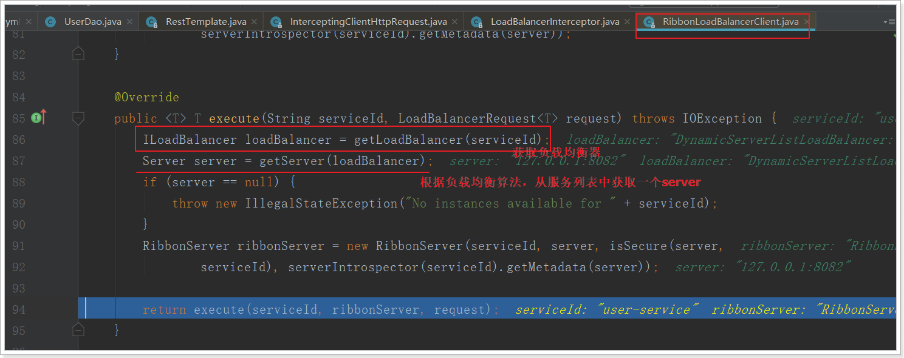

再跟下一次，发现获取的是8081：

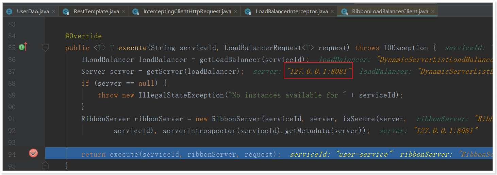


## 6.4.负载均衡策略

Ribbon默认的负载均衡策略是简单的轮询，我们可以测试一下：

编写测试类，在刚才的源码中我们看到拦截中是使用RibbonLoadBalanceClient来进行负载均衡的，其中有一个choose方法，找到choose方法的接口方法，是这样介绍的：

 

现在这个就是负载均衡获取实例的方法。

我们注入这个类的对象，然后对其测试：

 

测试内容：

```java
@RunWith(SpringRunner.class)
@SpringBootTest(classes = ItcastServiceConsumerApplication.class)
public class LoadBalanceTest {

    @Autowired
    private RibbonLoadBalancerClient client;

    @Test
    public void testLoadBalance(){
        for (int i = 0; i < 100; i++) {
            ServiceInstance instance = this.client.choose("service-provider");
            System.out.println(instance.getHost() + ":" +instance.getPort());
        }
    }
}

```

结果：

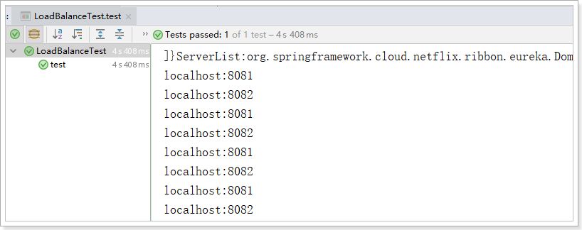

符合了我们的预期推测，确实是轮询方式。


我们是否可以修改负载均衡的策略呢？

继续跟踪源码，发现这么一段代码：

 

我们看看这个rule是谁：

 

这里的rule默认值是一个`RoundRobinRule`，看类的介绍：

 

这不就是轮询的意思嘛。

我们注意到，这个类其实是实现了接口IRule的，查看一下：

 

定义负载均衡的规则接口。

它有以下实现：

 

SpringBoot也帮我们提供了修改负载均衡规则的配置入口，在itcast-service-consumer的application.yml中添加如下配置：

```yaml
server:
  port: 80
spring:
  application:
    name: service-consumer
eureka:
  client: 
    service-url:
      defaultZone: http://127.0.0.1:10086/eureka
service-provider:
  ribbon:
    NFLoadBalancerRuleClassName: com.netflix.loadbalancer.RandomRule
```

格式是：`{服务名称}.ribbon.NFLoadBalancerRuleClassName`，值就是IRule的实现类。


再次测试，发现结果变成了随机：


